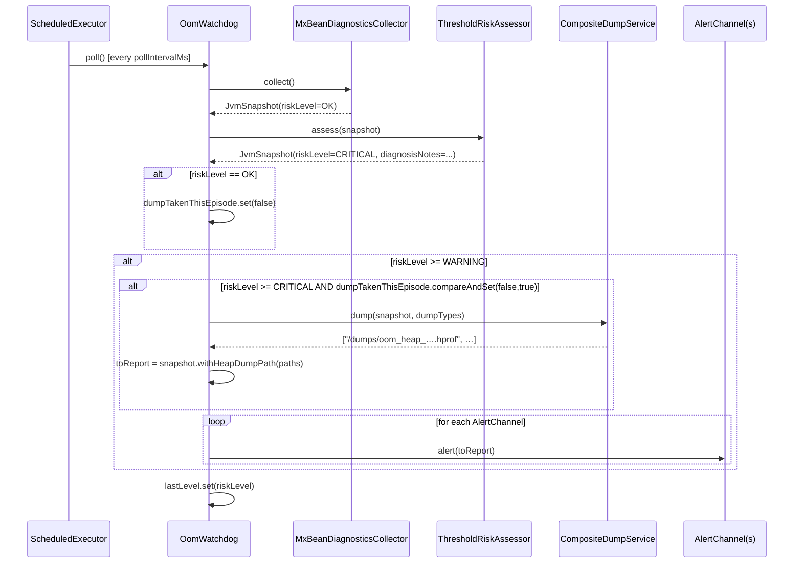
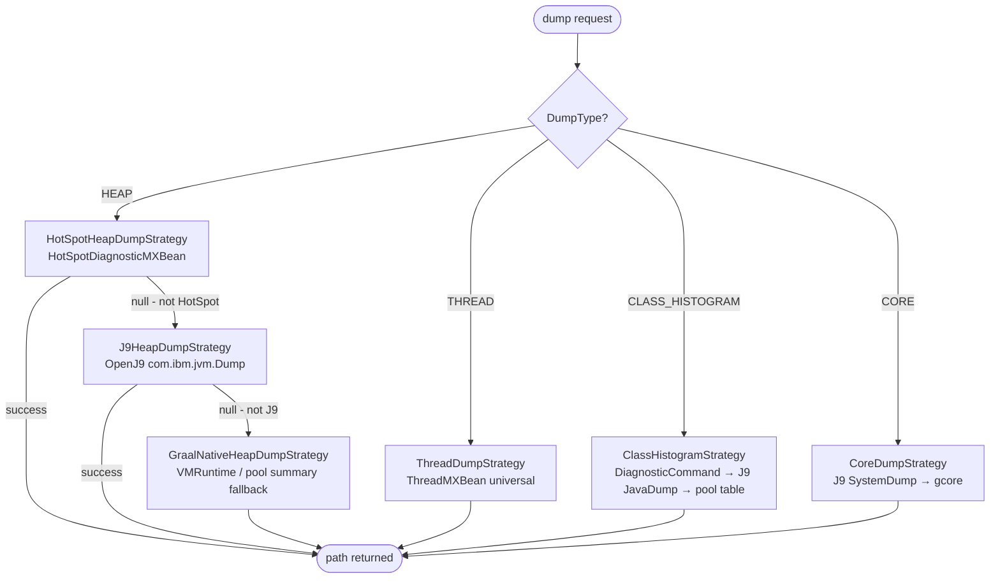
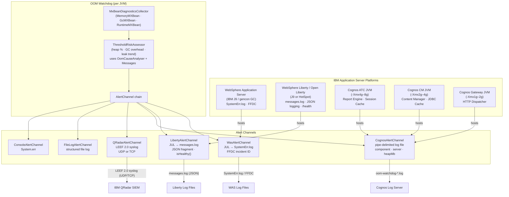

# OOM Watchdog – Architecture (v1.7.0)

## Overview

OOM Watchdog is a zero-dependency, production-quality JVM memory watchdog library that
preemptively detects Out-Of-Memory conditions and fires structured alerts before the JVM
crashes.  It supports **all major JVM vendors** (HotSpot, IBM J9/OpenJ9, GraalVM JVM,
GraalVM Native Image) and **JDK 8 through 26+**.

**v1.7.0 additions:** Multi-target JVM monitoring daemon with remote JMX collector (`com.trongus.oom.remote` package: `TargetDescriptor`, `TargetRegistry`, `JmxDiagnosticsCollector`, `WatchdogDaemon`), target JVM tag propagation in `JvmSnapshot`, `QRadarAlertChannel` LEEF attribute `targetJvm`, and CLI daemon flags (`--daemon`, `--targets-file`).

**v1.6.0 additions:** `WatchdogLogger` structured JUL logging subsystem, `WatchdogConfig.logLevel(Level)`, CLI `--log-level` flag.

**v1.5.0 additions:** Example 11 (`Example11CauseAnalysisAndI18n`) demonstrating
`OomCauseAnalyser` standalone and locale-aware watchdog wiring; per-release Quick Start
guide in `EXAMPLES.md`; all example `@version` tags updated; security audit badge updated
to reflect 4 passes.

**v1.4.0 additions:** Security hardening — `AtomicBoolean.compareAndSet` (SEC-2),
`AtomicReference<OomRiskLevel>` (SEC-3), `CopyOnWriteArrayList` (SEC-4).

**v1.3.0 additions:** `OomCauseAnalyser` (root-cause analysis), `OomCause`/`OomCauseCategory`
value objects, `Messages` i18n wrapper, and 9-locale resource bundles.  All alert text,
section headings, and diagnosis strings are now locale-aware.

The design follows the five SOLID principles throughout: every class has one reason to
change, new behaviour is added by extension rather than modification, subtypes are fully
substitutable, interfaces are narrow, and all high-level modules depend on abstractions.

---

## Component Diagram

```mermaid
graph TD
    CLI["WatchdogMain (CLI)"] -->|builds| W["OomWatchdog (Orchestrator)"]
    CLI -->|or builds| DAE["WatchdogDaemon (Multi-target)"]
    DAE -->|loads| REG["TargetRegistry"]
    REG -->|parses| TD["TargetDescriptor"]
    DAE -->|manages N x| W
    W --> C["JvmDiagnosticsCollector"]
    W --> A["RiskAssessor"]
    W --> CH["AlertChannel(s)"]
    W --> D["HeapDumpService"]
    W --> WC["WatchdogConfig"]

    C -->|impl (local)| MX["MxBeanDiagnosticsCollector"]
    C -->|impl (remote JMX)| JMX["JmxDiagnosticsCollector"]
    A -->|impl| TR["ThresholdRiskAssessor"]
    CH -->|impl| CON["ConsoleAlertChannel"]
    CH -->|impl| FILE["FileLogAlertChannel"]
    CH -->|impl| QR["QRadarAlertChannel (LEEF 2.0)"]
    CH -->|impl| WAS["WasAlertChannel (JUL → SystemErr.log)"]
    CH -->|impl| LIB["LibertyAlertChannel (JUL → messages.log)"]
    CH -->|impl| COG["CognosAlertChannel (pipe-delimited log)"]
    D -->|impl| CDS["CompositeDumpService"]

    CDS --> S1["HotSpotHeapDumpStrategy"]
    CDS --> S2["J9HeapDumpStrategy"]
    CDS --> S3["GraalNativeHeapDumpStrategy"]
    CDS --> S4["ThreadDumpStrategy"]
    CDS --> S5["ClassHistogramStrategy"]
    CDS --> S6["CoreDumpStrategy"]

    MX -->|reads| JP["JvmPlatform (static detection)"]
    CDS -->|reads| JP
    MX -->|produces| SNAP["JvmSnapshot (immutable value object)"]
    TR -->|consumes/produces| SNAP

    TR -->|uses| CA["OomCauseAnalyser"]
    TR -->|uses| MSG["Messages (i18n)"]
    MX -->|uses| MSG
    CA -->|produces| OC["OomCause + OomCauseCategory"]

    subgraph model
        SNAP
        ORL["OomRiskLevel (OK/WARNING/CRITICAL/OOM_FIRING)"]
    end

    subgraph i18n
        MSG
        OC
    end

    subgraph config
        WC
    end
```

---

## Class Diagram

```mermaid
classDiagram
    class OomWatchdog {
        -WatchdogConfig config
        -JvmDiagnosticsCollector collector
        -RiskAssessor assessor
        -List~AlertChannel~ alertChannels
        -HeapDumpService dumpService
        -ScheduledExecutorService scheduler
        -ScheduledFuture task
        -AtomicBoolean dumpTakenThisEpisode
        -AtomicReference~OomRiskLevel~ lastLevel
        +OomWatchdog(WatchdogConfig, JvmDiagnosticsCollector, RiskAssessor, List, HeapDumpService)
        +start()
        +stop()
        +getLastRiskLevel() OomRiskLevel
        -poll()
    }

    class JvmDiagnosticsCollector {
        <<interface>>
        +collect() JvmSnapshot
    }

    class RiskAssessor {
        <<interface>>
        +assess(JvmSnapshot) JvmSnapshot
    }

    class AlertChannel {
        <<interface>>
        +alert(JvmSnapshot)
        +channelName() String
    }

    class HeapDumpService {
        <<interface>>
        +dump(JvmSnapshot, List~DumpType~) List~String~
    }

    class MxBeanDiagnosticsCollector {
        -WatchdogConfig config
        -Messages messages
        -Deque~long[]~ postGcWindow
        -long prevTotalGcTime
        +MxBeanDiagnosticsCollector(WatchdogConfig)
        +collect() JvmSnapshot
        -computeSlope(Deque~long[]~) double
    }

    class ThresholdRiskAssessor {
        -WatchdogConfig config
        -Messages messages
        -OomCauseAnalyser causeAnalyser
        +ThresholdRiskAssessor(WatchdogConfig)
        +assess(JvmSnapshot) JvmSnapshot
    }

    class ConsoleAlertChannel {
        +alert(JvmSnapshot)
        +channelName() String
    }

    class FileLogAlertChannel {
        -Path logPath
        +FileLogAlertChannel(String)
        +alert(JvmSnapshot)
    }

    class QRadarAlertChannel {
        -String qradarHost
        -int qradarPort
        -Transport transport
        -String localHostname
        +QRadarAlertChannel(String, int, Transport)
        +alert(JvmSnapshot)
    }

    class WasAlertChannel {
        +alert(JvmSnapshot)
        +channelName() String
    }

    class LibertyAlertChannel {
        -AtomicReference~OomRiskLevel~ lastRiskLevel
        +alert(JvmSnapshot)
        +isHealthy() boolean
        +getLastRiskLevel() OomRiskLevel
    }

    class CognosAlertChannel {
        -String cognosComponent
        -String logFilePath
        +CognosAlertChannel(String, String)
        +alert(JvmSnapshot)
    }

    class AlertFormatter {
        <<package-private>>
        +toHumanReadable(JvmSnapshot) String
        +toHumanReadable(JvmSnapshot, Messages) String
        +toSingleLine(JvmSnapshot) String
        -sanitiseMultiLine(String) String
        -sanitiseSingleLine(String) String
    }

    class CompositeDumpService {
        -WatchdogConfig config
        -Map~DumpType, List~DumpStrategy~~ chains
        +CompositeDumpService(WatchdogConfig)
        +dump(JvmSnapshot, List~DumpType~) List~String~
        -buildChains() Map
        -buildPath(JvmSnapshot, DumpType) String
    }

    class DumpStrategy {
        <<interface>>
        +type() DumpType
        +attempt(JvmSnapshot, String) String
        +name() String
    }

    class JvmSnapshot {
        +String processName
        +long timestampMs
        +long heapUsedBytes
        +long heapCommittedBytes
        +long heapMaxBytes
        +double heapUsedRatio
        +long nonHeapUsedBytes
        +long nonHeapMaxBytes
        +Map~String,Long~ poolUsedBytes
        +Map~String,Long~ gcCollectionCounts
        +Map~String,Long~ gcCollectionTimesMs
        +long totalGcTimeMs
        +long jvmUptimeMs
        +double gcOverheadRatio
        +long postGcHeapUsedBytes
        +double postGcHeapGrowthRatePerMs
        +OomRiskLevel riskLevel
        +String diagnosisNotes
        +String heapDumpPath
        +withHeapDumpPath(String) JvmSnapshot
        +toBuilder() Builder
    }

    class OomRiskLevel {
        <<enumeration>>
        OK
        WARNING
        CRITICAL
        OOM_FIRING
    }

    class WatchdogConfig {
        +double warningHeapThreshold
        +double criticalHeapThreshold
        +double gcOverheadThreshold
        +int leakDetectionWindowSize
        +long pollIntervalMs
        +String heapDumpDirectory
        +Set~DumpType~ dumpTypes
        +String qradarHost
        +int qradarPort
        +Locale locale
        +defaults() Builder
        +getLocale() Locale
    }

    class JvmPlatform {
        +int JDK_VERSION$
        +boolean IS_GRAAL_NATIVE$
        +boolean IS_GRAAL_JVM$
        +boolean IS_J9$
        +boolean IS_HOTSPOT$
        +long PID$
        +summary() String$
    }

    class OomCauseAnalyser {
        -double criticalHeapThreshold
        -double gcOverheadThreshold
        -Messages messages
        +OomCauseAnalyser(double, double, Messages)
        +analyse(double, double, double) OomCause
    }

    class OomCause {
        -OomCauseCategory category
        -String explanation
        +getCategory() OomCauseCategory
        +getExplanation() String
    }

    class OomCauseCategory {
        <<enumeration>>
        NONE
        MEMORY_LEAK_TREND
        GC_OVERHEAD_EXCEEDED
        HEAP_EXHAUSTION
        RUNAWAY_GC_WITH_HIGH_HEAP
    }

    class Messages {
        -ResourceBundle bundle
        -Locale locale
        +Messages(Locale)
        +get(String) String
        +format(String, Object...) String
    }

    OomWatchdog --> JvmDiagnosticsCollector
    OomWatchdog --> RiskAssessor
    OomWatchdog --> AlertChannel
    OomWatchdog --> HeapDumpService
    OomWatchdog --> WatchdogConfig

    MxBeanDiagnosticsCollector ..|> JvmDiagnosticsCollector
    ThresholdRiskAssessor ..|> RiskAssessor
    ConsoleAlertChannel ..|> AlertChannel
    FileLogAlertChannel ..|> AlertChannel
    QRadarAlertChannel ..|> AlertChannel
    WasAlertChannel ..|> AlertChannel
    LibertyAlertChannel ..|> AlertChannel
    CognosAlertChannel ..|> AlertChannel
    CompositeDumpService ..|> HeapDumpService

    FileLogAlertChannel --> AlertFormatter
    ConsoleAlertChannel --> AlertFormatter
    CompositeDumpService --> DumpStrategy
    CompositeDumpService --> JvmPlatform
    MxBeanDiagnosticsCollector --> JvmSnapshot
    MxBeanDiagnosticsCollector --> JvmPlatform
    MxBeanDiagnosticsCollector --> Messages
    ThresholdRiskAssessor --> JvmSnapshot
    ThresholdRiskAssessor --> Messages
    ThresholdRiskAssessor --> OomCauseAnalyser
    OomCauseAnalyser --> OomCause
    OomCause --> OomCauseCategory
    JvmSnapshot --> OomRiskLevel
```



---

## Poll Cycle Sequence Diagram



---

## Dump Strategy Chain (Decision Flow)



---

## Module Structure

```
oom-watchdog/                  Maven multi-module root (v1.5.0)
├── core/                      oom-watchdog.jar  (fat jar via maven-shade-plugin)
│   └── src/main/java/com/trongus/oom/
│       ├── WatchdogMain.java  CLI entry point
│       ├── alert/             AlertChannel (interface) + 6 implementations
│       │                      (Console, FileLog, QRadar, Was, Liberty, Cognos)
│       │                      + AlertFormatter (package-private, i18n-aware)
│       ├── collector/         JvmDiagnosticsCollector (interface)
│       │                      + MxBeanDiagnosticsCollector
│       ├── config/            WatchdogConfig (immutable builder, locale)
│       ├── diagnosis/         OomCause + OomCauseCategory + OomCauseAnalyser  ← v1.3.0
│       ├── dump/              HeapDumpService (interface) + CompositeDumpService
│       │                      + DumpType enum
│       │   └── strategy/      DumpStrategy (interface) + 6 implementations
│       │                      (HotSpotHeapDump, J9HeapDump, GraalNativeHeapDump,
│       │                       ThreadDump, ClassHistogram, CoreDump)
│       ├── examples/          11 runnable example classes (01–11)
│       ├── i18n/              Messages (UTF-8 ResourceBundle wrapper)           ← v1.3.0
│       ├── model/             JvmSnapshot (immutable value object)
│       │                      + OomRiskLevel enum
│       ├── monitor/           OomWatchdog + RiskAssessor (interface)
│       │                      + ThresholdRiskAssessor
│       ├── platform/          JvmPlatform (static detection, all fields final)
│       ├── remote/            TargetDescriptor, TargetRegistry, JmxDiagnosticsCollector, WatchdogDaemon  ← v1.7.0
│       └── test/              OomSimulator (3-phase heap exhaustion)
│   └── src/main/resources/com/trongus/oom/i18n/
│       ├── Messages.properties       English (base / fallback)
│       ├── Messages_de.properties    German
│       ├── Messages_es.properties    Spanish
│       ├── Messages_fr.properties    French
│       ├── Messages_ja.properties    Japanese (UTF-8)
│       ├── Messages_ko.properties    Korean (UTF-8)
│       ├── Messages_pt_BR.properties Brazilian Portuguese
│       ├── Messages_zh_CN.properties Simplified Chinese (UTF-8)
│       └── Messages_zh_TW.properties Traditional Chinese (UTF-8)
│
├── test-harness/              test-harness.jar
│   └── src/main/java/com/trongus/oom/harness/
│       ├── TestHarnessMain.java
│       ├── DynamicOomClassGenerator.java  (javax.tools at runtime)
│       ├── BuiltInHeapExhauster.java
│       └── HarnessAlertRecorder.java      (CopyOnWriteArrayList + AtomicInteger)
│
└── oom-watchdog-tests/        JUnit 4 test suite (189 tests)
    └── src/test/java/com/trongus/oom/tests/
        ├── OomWatchdogTestSuite.java
        ├── model/             OomRiskLevelTest, JvmSnapshotTest
        ├── config/            WatchdogConfigTest
        ├── dump/              DumpTypeTest, CompositeDumpServiceTest
        ├── alert/             AlertFormatterTest, FileLogAlertChannelTest
        ├── collector/         MxBeanDiagnosticsCollectorTest
        ├── monitor/           ThresholdRiskAssessorTest
        ├── platform/          JvmPlatformTest
        └── integration/       OomWatchdogIntegrationTest
```

---

## Logging Destinations by Platform

The following table shows exactly where OOM Watchdog alert output appears for every supported runtime. All channels are composable; add multiple channels to send alerts to multiple destinations simultaneously.

| Runtime / Platform | Alert Channel(s) | Log file / destination | Format | JUL level |
|--------------------|-----------------|----------------------|--------|-----------|
| **Any JVM** (stdout/err) | `ConsoleAlertChannel` | `System.err` | Multi-line human-readable | n/a |
| **Any JVM** (file) | `FileLogAlertChannel` | Configured file path (append, UTF-8) | Single-line + multi-line | n/a |
| **Any JVM** (SIEM) | `QRadarAlertChannel` | QRadar SIEM via UDP or TCP port 514 | LEEF 2.0 syslog | n/a |
| **HotSpot** (Oracle/OpenJDK/Azul/Corretto) | `FileLogAlertChannel` | `/var/log/oom-watchdog.log` (example) | Single-line + multi-line | n/a |
| **OpenJ9 / IBM J9** (standalone) | `FileLogAlertChannel` | `/var/log/oom-watchdog.log` (example) | Single-line + multi-line | n/a |
| **GraalVM JVM** | `FileLogAlertChannel` | `/var/log/oom-watchdog.log` (example) | Single-line + multi-line | n/a |
| **GraalVM Native Image** | `FileLogAlertChannel` | `/var/log/oom-watchdog.log` (example) | Single-line + multi-line | n/a |
| **WAS** (traditional) | `WasAlertChannel` | `${SERVER_LOG_ROOT}/SystemErr.log` | Key=value + FFDC ID | `WARNING` / `SEVERE` |
| **WAS** (traditional) | `WasAlertChannel` | `${SERVER_LOG_ROOT}/SystemOut.log` | — | Never (watchdog omits INFO) |
| **WAS** (traditional) | `WasAlertChannel` | `${SERVER_LOG_ROOT}/ffdc/` | FFDC cross-reference only | `SEVERE` triggers FFDC |
| **Liberty / Open Liberty** | `LibertyAlertChannel` | `${server.output.dir}/logs/messages.log` | Key=value (always present) | `WARNING` / `SEVERE` |
| **Liberty** (JSON mode) | `LibertyAlertChannel` | `messages.log` | JSON object per event | `WARNING` / `SEVERE` |
| **Liberty** (foreground) | `LibertyAlertChannel` | `console.log` | Mirrors messages.log | `WARNING` / `SEVERE` |
| **Liberty** (trace enabled) | `LibertyAlertChannel` | `trace.log` | All levels | `WARNING` / `SEVERE` |
| **Cognos ATC JVM** | `CognosAlertChannel` | `oom-watchdog-ATC.log` (configured) | Pipe-delimited | n/a (file write) |
| **Cognos CM JVM** | `CognosAlertChannel` | `oom-watchdog-CM.log` (configured) | Pipe-delimited | n/a (file write) |
| **Cognos Gateway JVM** | `CognosAlertChannel` | `oom-watchdog-GW.log` (configured) | Pipe-delimited | n/a (file write) |
| **Cognos on WAS** (secondary) | `CognosAlertChannel` | `SystemErr.log` (via JUL) | Key=value | `WARNING` / `SEVERE` |
| **Cognos on Liberty** (secondary) | `CognosAlertChannel` | `messages.log` (via JUL) | Key=value | `WARNING` / `SEVERE` |

**Notes:**
- "JUL level" refers to the `java.util.logging.Level` emitted. WAS and Liberty intercept JUL automatically; no custom handler registration is required.
- `WARNING` is emitted for `OomRiskLevel.WARNING`; `SEVERE` is emitted for `CRITICAL` and `OOM_FIRING`.
- For Cognos, the dedicated `.log` file is the **primary** output. The JUL secondary output only fires if Cognos runs inside WAS or Liberty.

---

## Key Design Decisions

| Decision | Rationale |
|----------|-----------|
| Pure `java.lang.management` MXBeans for collection | No native agent needed; works on all JVMs from JDK 8+ |
| Strategy pattern for dump dispatch | Adding a new vendor dump requires only a new `DumpStrategy` class |
| OLS slope on post-GC heap samples | Detects slow leaks that thresholds alone miss |
| Episode deduplication in `OomWatchdog` | Prevents dump storms during a sustained critical episode |
| `AtomicBoolean.compareAndSet(false,true)` for dump guard | Atomic check-and-set eliminates check-then-act race (SEC-2) |
| `AtomicReference<OomRiskLevel>` for `lastLevel` | Consistent cross-thread memory visibility without `synchronized` (SEC-3) |
| Immutable `JvmSnapshot` with `withHeapDumpPath()` copy | Thread-safe, trivially testable, no shared mutable state |
| Defensive copies in `JvmSnapshot.Builder` map setters | Caller-mutated maps cannot corrupt in-flight snapshots |
| `AlertFormatter` sanitises all free-text fields | Prevents control-character injection into log/syslog output |
| `AlertFormatter` package-private | Formatting is an implementation detail; only alert channels need it |
| `WatchdogConfig` immutable builder with full validation | Config cannot drift at runtime; rejects out-of-range values at construction |
| `WatchdogConfig.locale()` | Single locale setting propagates to `Messages`, `OomCauseAnalyser`, and `AlertFormatter` |
| LEEF 2.0 for QRadar | Native IBM SIEM format; field-indexed for high-speed correlation |
| TCP socket connect + read timeout (5 s) | Slow/unreachable QRadar host cannot block the watchdog poll thread |
| UDP payload capped at 65 007 bytes | Prevents silent datagram truncation on standard Ethernet MTUs |
| `gcore` path canonicalization + 60 s timeout | Prevents path-traversal; avoids hung dump process blocking the JVM |
| `AtomicInteger` counters in `HarnessAlertRecorder` | Thread-safe read-modify-write without external synchronisation |
| `CopyOnWriteArrayList` for `HarnessAlertRecorder.dumpPaths` | Lock-free iteration from the results thread; no unsynchronised read race (SEC-4) |
| All file writes use explicit `StandardCharsets.UTF_8` | Consistent output across all platforms; no platform-default charset risk |
| `ResourceBundle.Control` with UTF-8 reader | Prevents ISO-8859-1 corruption of CJK double-byte characters in `.properties` files |
| `OomCauseAnalyser` stateless | Can be shared across threads; no synchronisation cost |
| `OomCause` immutable value object | Safe to pass across threads with no defensive copy |

---

## Security Hardening Summary

Four security audit passes have been performed.  Passes 1 and 2 identified and
fixed 11 issues.  Pass 3 reviewed all remaining source files and confirmed no
further issues.  Pass 4 identified and fixed 3 concurrency issues (SEC-2, SEC-3, SEC-4).

| # | Audit | File | Issue | Fix |
|---|-------|------|-------|-----|
| 1 | 1–2 | `WatchdogConfig` | No range validation on numeric fields | `build()` rejects thresholds outside `(0,1)`, `pollIntervalMs < 100`, `leakDetectionWindowSize < 2`, `qradarPort` outside `[1,65535]`, blank `heapDumpDirectory` |
| 2 | 1–2 | `WatchdogMain` | CLI values passed to builder without validation | Parser clamps/rejects out-of-range values before calling `build()` |
| 3 | 1–2 | `QRadarAlertChannel` | TCP socket had no timeout | `socket.connect()` + `setSoTimeout()` both set to 5 s |
| 4 | 1–2 | `QRadarAlertChannel` | UDP payload not length-checked | Payload truncated to `MAX_UDP_PAYLOAD = 65 007` bytes before send |
| 5 | 1–2 | `CoreDumpStrategy` | `gcore` had no timeout; unbounded output accumulation | `waitFor(60, SECONDS)` + `destroyForcibly()`; output capped at 4 096 bytes |
| 6 | 1–2 | `CoreDumpStrategy` | `outputPath` not canonicalized — path-traversal risk | `File.getCanonicalPath()` applied before passing to `ProcessBuilder` |
| 7 | 1–2 | `DynamicOomClassGenerator` | `FileWriter` used platform default charset | Replaced with `OutputStreamWriter(…, UTF_8)` |
| 8 | 1–2 | `HotSpotHeapDumpService` | All three `FileWriter` usages used platform default charset | Replaced with `OutputStreamWriter(…, UTF_8)` |
| 9 | 1–2 | `AlertFormatter` | Free-text fields embedded unsanitised | `sanitiseMultiLine()` strips control chars in human-readable output; `sanitiseSingleLine()` strips newlines + quotes in single-line output |
| 10 | 1–2 | `JvmSnapshot.Builder` | Map setters stored caller's reference | Defensive `LinkedHashMap` copy taken in all three map setter methods |
| 11 | 3 | `HarnessAlertRecorder` | `volatile int++` is not atomic under concurrent access | Replaced with `AtomicInteger.incrementAndGet()` |
| SEC-2 | 4 | `OomWatchdog` | `volatile boolean dumpTakenForCurrentEpisode` — check-then-act race between poll cycles | Replaced with `AtomicBoolean.compareAndSet(false, true)` |
| SEC-3 | 4 | `OomWatchdog` | `volatile OomRiskLevel lastLevel` — weak memory ordering for `getLastRiskLevel()` callers | Replaced with `AtomicReference<OomRiskLevel>` |
| SEC-4 | 4 | `HarnessAlertRecorder` | `ArrayList dumpPaths` — `synchronized` writes but unsynchronised iteration in `printResults()` | Replaced with `CopyOnWriteArrayList` |

---

## Release Artefacts

The v1.5.0 release publishes two executable fat JARs built with `maven-shade-plugin`.
Both are attached to the [GitHub release](https://github.com/kgillard/oom-watchdog/releases/tag/v1.5.0).

| Artefact | Main class | Contents | Size (approx) |
|----------|-----------|----------|---------------|
| `oom-watchdog.jar` | `com.trongus.oom.WatchdogMain` | `core` module + all runtime dependencies shaded | ~161 KB |
| `test-harness.jar` | `com.trongus.oom.harness.TestHarnessMain` | `test-harness` + `core` modules shaded | ~175 KB |

### Build reproducibility

```bash
cd oom-watchdog
mvn clean package -DskipTests -q
# core/target/oom-watchdog.jar
# test-harness/target/test-harness.jar
```

---

## IBM Application Server Support

OOM Watchdog 1.2.0 extends the `AlertChannel` interface with three new implementations
targeting IBM application server platforms: `WasAlertChannel`, `LibertyAlertChannel`,
and `CognosAlertChannel`.  All three use `java.util.logging` (JUL) as the sole
external dependency, which each server intercepts and routes at runtime.

---

### WAS (WebSphere Application Server) — traditional

| Characteristic | Detail |
|----------------|--------|
| JVM vendor     | IBM J9 (IBM SDK for Java 8; also available on OpenJ9) |
| GC policy      | `gencon` by default (generational + concurrent); configurable via `-Xgcpolicy` |
| Heap model     | Nursery (`-Xmn`) + tenure space; typical production heap 1 GB – 4 GB |
| Logging        | JUL records intercepted by WAS logging handler; routed to `SystemOut.log` (INFO and below) and `SystemErr.log` (WARNING and above) |
| FFDC           | First Failure Data Capture: WAS generates an FFDC incident file in `${SERVER_LOG_ROOT}/ffdc/` on exception; `WasAlertChannel` includes a matching incident ID in every log entry |
| Thread pool    | WAS manages web-container and EJB thread pools independently; the watchdog scheduler uses its own `ScheduledExecutorService` and does not consume a WAS-managed thread |
| Poll interval  | 30 s recommended for production WAS (heap growth is gradual; aligns with WAS PMI 10–60 s sampling) |

**How `WasAlertChannel` integrates:**

1. Emits a JUL `WARNING`/`SEVERE` record to logger `com.trongus.oom.WasAlert`.
2. WAS's built-in JUL handler writes the record to `SystemErr.log`.
3. A structured single-line entry is also written to `System.err` for FFDC correlation.
4. Logger level is configured via WAS Admin Console → **Logging and Tracing →
   Change Log Detail Levels** → `com.trongus.oom.*=ALL`.

---

### Liberty (WebSphere Liberty / Open Liberty)

| Characteristic | Detail |
|----------------|--------|
| JVM vendor     | IBM J9 / OpenJ9 (default); HotSpot also supported |
| Heap model     | Standard JVM heap; typical container deployments use 256 MB – 512 MB (`-Xmx`) |
| Logging        | JUL unified with Liberty's logging pipeline; output goes to `messages.log`, `console.log`, and `trace.log` depending on level and `server.xml` configuration |
| JSON logging   | When `messageFormat="JSON"` is set in `server.xml`, every JUL record is emitted as a JSON object; `LibertyAlertChannel` embeds a JSON fragment as the log message so all OOM fields are top-level JSON keys queryable in Elastic / Splunk / IBM Log Analysis |
| MicroProfile   | Liberty exposes `/health` endpoints backed by MicroProfile Health; `LibertyAlertChannel.isHealthy()` is designed for direct use in a `@Liveness` `HealthCheck` implementation |
| CDI lifecycle  | Managed via `@ApplicationScoped` + `@PostConstruct` / `@PreDestroy` |

**How `LibertyAlertChannel` integrates:**

1. Emits a JUL `WARNING`/`SEVERE` record to logger `com.trongus.oom.LibertyAlert` with a
   JSON-fragment message body.
2. Liberty routes the record to `messages.log` (always) and `console.log` (if foreground).
3. When JSON logging is active, all OOM fields appear as top-level JSON keys.
4. `isHealthy()` / `getLastRiskLevel()` enable direct MicroProfile Health wiring.

---

### Cognos Analytics — multiple JVM processes

Cognos Analytics runs three or more separate JVM processes.  Each is monitored
independently by its own `OomWatchdog` instance paired with a `CognosAlertChannel`.

| Component             | Default JVM | Primary OOM causes                                     | Recommended `-Xmx` |
|-----------------------|-------------|--------------------------------------------------------|---------------------|
| Application Tier (ATC)| IBM J9      | Large report datasets, PDF rendering, session caches   | 4 GB – 8 GB         |
| Content Manager (CM)  | IBM J9      | JDBC result caches, XML metadata trees                 | 2 GB – 4 GB         |
| Gateway / Dispatcher  | IBM J9      | HTTP session routing, request buffering                | 1 GB – 2 GB         |

**How `CognosAlertChannel` integrates:**

1. Writes a pipe-delimited structured log entry to a dedicated Cognos alert log file
   (`oom-watchdog-ATC.log`, etc.) that the Cognos Log Server can ingest.
2. Emits a JUL record at the appropriate level for the application server hosting Cognos.
3. Log entries include `cognosComponent`, `cognosServer`, `reportEngineHeapMb`, and all
   standard JVM memory metrics.
4. The log file path and Cognos component name are configured at construction time.

---

### Architecture diagram — WAS / Liberty / Cognos → OOM Watchdog → QRadar


