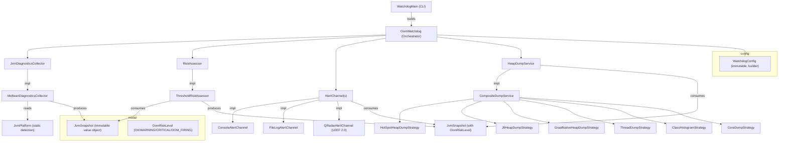
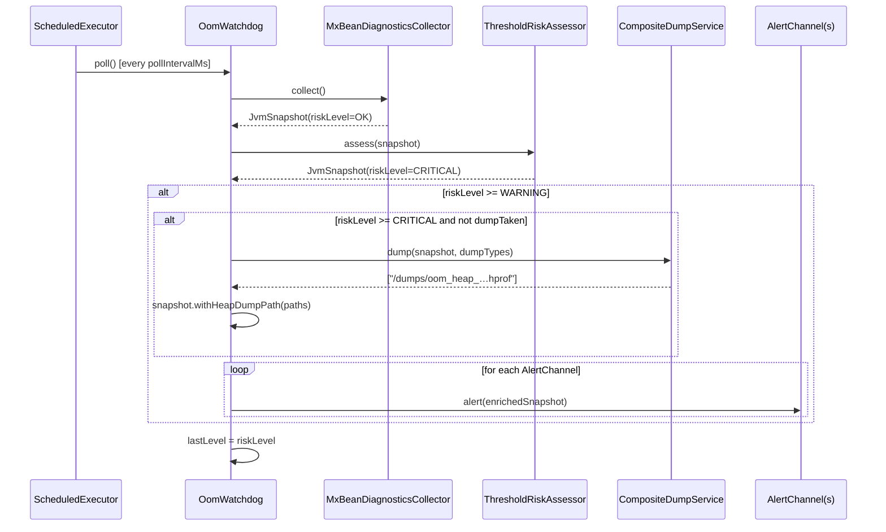
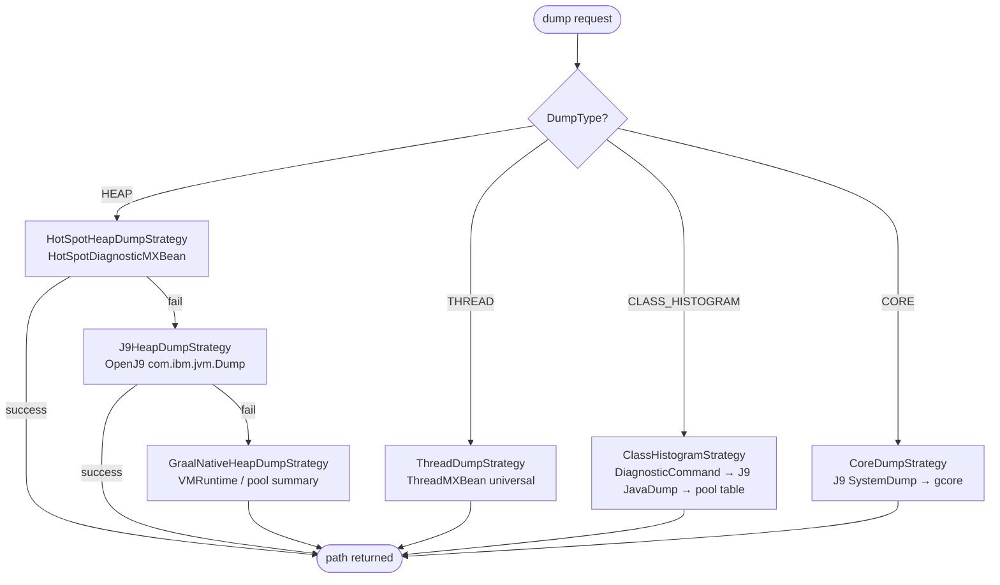
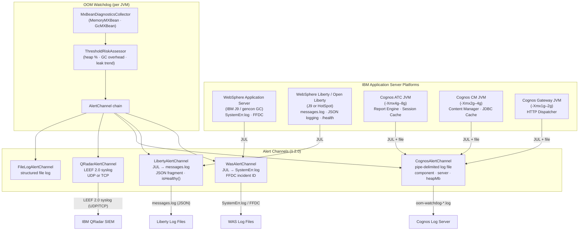

# OOM Watchdog – Architecture

## Overview

OOM Watchdog is a zero-dependency, production-quality JVM memory watchdog library that
preemptively detects Out-Of-Memory conditions and fires structured alerts before the JVM
crashes.  It supports **all major JVM vendors** (HotSpot, IBM J9/OpenJ9, GraalVM JVM,
GraalVM Native Image) and **JDK 8 through 26+**.

The design follows the five SOLID principles throughout: every class has one reason to
change, new behaviour is added by extension rather than modification, subtypes are fully
substitutable, interfaces are narrow, and all high-level modules depend on abstractions.

---

## Component Diagram



---

## Class Diagram

```mermaid
classDiagram
    class OomWatchdog {
        -WatchdogConfig config
        -JvmDiagnosticsCollector collector
        -RiskAssessor assessor
        -List~AlertChannel~ alertChannels
        -HeapDumpService dumpService
        -ScheduledExecutorService scheduler
        +start()
        +stop()
        +getLastRiskLevel() OomRiskLevel
        -poll()
    }

    class JvmDiagnosticsCollector {
        <<interface>>
        +collect() JvmSnapshot
    }

    class RiskAssessor {
        <<interface>>
        +assess(JvmSnapshot) JvmSnapshot
    }

    class AlertChannel {
        <<interface>>
        +alert(JvmSnapshot)
        +channelName() String
    }

    class HeapDumpService {
        <<interface>>
        +dump(JvmSnapshot, List~DumpType~) List~String~
    }

    class MxBeanDiagnosticsCollector {
        -WatchdogConfig config
        -Deque~long[]~ postGcWindow
        +collect() JvmSnapshot
        -computeSlope(List~long[]~) double
    }

    class ThresholdRiskAssessor {
        -WatchdogConfig config
        +assess(JvmSnapshot) JvmSnapshot
    }

    class ConsoleAlertChannel
    class FileLogAlertChannel {
        -Path logPath
    }
    class QRadarAlertChannel {
        -String host
        -int port
        -String protocol
    }

    class AlertFormatter {
        <<package-private>>
        +toHumanReadable(JvmSnapshot) String$
        +toSingleLine(JvmSnapshot) String$
    }

    class CompositeDumpService {
        -WatchdogConfig config
        -Map~DumpType, List~DumpStrategy~~ chains
        +dump(JvmSnapshot, List~DumpType~) List~String~
        -buildChains() Map$
        -buildPath(JvmSnapshot, DumpType) String
    }

    class DumpStrategy {
        <<interface>>
        +attempt(JvmSnapshot, String) String
        +name() String
    }

    class JvmSnapshot {
        +processName String
        +timestampMs long
        +heapUsedBytes long
        +heapMaxBytes long
        +heapUsedRatio double
        +gcOverheadRatio double
        +postGcHeapGrowthRatePerMs double
        +riskLevel OomRiskLevel
        +withHeapDumpPath(String) JvmSnapshot
    }

    class OomRiskLevel {
        <<enumeration>>
        OK
        WARNING
        CRITICAL
        OOM_FIRING
    }

    class WatchdogConfig {
        +warningHeapThreshold double
        +criticalHeapThreshold double
        +gcOverheadThreshold double
        +pollIntervalMs long
        +heapDumpDirectory String
        +dumpTypes Set~DumpType~
    }

    class JvmPlatform {
        +JDK_VERSION int$
        +IS_GRAAL_NATIVE bool$
        +IS_J9 bool$
        +IS_HOTSPOT bool$
        +PID long$
        +summary() String$
    }

    OomWatchdog --> JvmDiagnosticsCollector
    OomWatchdog --> RiskAssessor
    OomWatchdog --> AlertChannel
    OomWatchdog --> HeapDumpService
    OomWatchdog --> WatchdogConfig

    MxBeanDiagnosticsCollector ..|> JvmDiagnosticsCollector
    ThresholdRiskAssessor ..|> RiskAssessor
    ConsoleAlertChannel ..|> AlertChannel
    FileLogAlertChannel ..|> AlertChannel
    QRadarAlertChannel ..|> AlertChannel
    CompositeDumpService ..|> HeapDumpService

    FileLogAlertChannel --> AlertFormatter
    ConsoleAlertChannel --> AlertFormatter
    CompositeDumpService --> DumpStrategy
    MxBeanDiagnosticsCollector --> JvmSnapshot
    ThresholdRiskAssessor --> JvmSnapshot
    JvmSnapshot --> OomRiskLevel
```



---

## Poll Cycle Sequence Diagram



---

## Dump Strategy Chain (Decision Flow)



---

## Module Structure

```
oom-watchdog/                  Maven multi-module root
├── core/                      oom-watchdog.jar  (fat jar via maven-shade-plugin)
│   └── src/main/java/com/trongus/oom/
│       ├── WatchdogMain.java  CLI entry point
│       ├── alert/             AlertChannel ISP + 3 implementations + AlertFormatter
│       ├── collector/         JvmDiagnosticsCollector + MxBeanDiagnosticsCollector
│       ├── config/            WatchdogConfig (immutable, builder)
│       ├── dump/              HeapDumpService + CompositeDumpService + DumpType + strategies
│       ├── model/             JvmSnapshot + OomRiskLevel
│       ├── monitor/           OomWatchdog + RiskAssessor + ThresholdRiskAssessor
│       ├── platform/          JvmPlatform (static detection)
│       └── test/              OomSimulator (3-phase heap exhaustion)
│
├── test-harness/              test-harness.jar
│   └── src/main/java/com/trongus/oom/harness/
│       ├── TestHarnessMain.java
│       ├── DynamicOomClassGenerator.java  (javax.tools at runtime)
│       ├── BuiltInHeapExhauster.java
│       └── HarnessAlertRecorder.java
│
└── oom-watchdog-tests/        JUnit 4 test suite (189 tests)
    └── src/test/java/com/trongus/oom/tests/
        ├── model/             OomRiskLevelTest, JvmSnapshotTest
        ├── config/            WatchdogConfigTest
        ├── dump/              DumpTypeTest, CompositeDumpServiceTest
        ├── alert/             AlertFormatterTest, FileLogAlertChannelTest
        ├── collector/         MxBeanDiagnosticsCollectorTest
        ├── monitor/           ThresholdRiskAssessorTest
        ├── platform/          JvmPlatformTest
        └── integration/       OomWatchdogIntegrationTest
```

---

## Key Design Decisions

| Decision | Rationale |
|----------|-----------|
| Pure `java.lang.management` MXBeans for collection | No native agent needed; works on all JVMs from JDK 8+ |
| Strategy pattern for dump dispatch | Adding a new vendor dump requires only a new `DumpStrategy` class |
| OLS slope on post-GC heap samples | Detects slow leaks that thresholds alone miss |
| Episode deduplication in `OomWatchdog` | Prevents dump storms during a sustained critical episode |
| Immutable `JvmSnapshot` with `withHeapDumpPath()` copy | Thread-safe, trivially testable, no shared mutable state |
| Defensive copies in `JvmSnapshot.Builder` map setters | Caller-mutated maps cannot corrupt in-flight snapshots |
| `AlertFormatter` sanitises all free-text fields | Prevents control-character injection into log/syslog output |
| `AlertFormatter` package-private | Formatting is an implementation detail; only alert channels need it |
| `WatchdogConfig` immutable builder with full validation | Config cannot drift at runtime; rejects out-of-range values at construction |
| LEEF 2.0 for QRadar | Native IBM SIEM format; field-indexed for high-speed correlation |
| TCP socket connect + read timeout (5 s) | Slow/unreachable QRadar host cannot block the watchdog poll thread |
| UDP payload capped at 65 007 bytes | Prevents silent datagram truncation on standard Ethernet MTUs |
| `gcore` path canonicalization + 60 s timeout | Prevents path-traversal; avoids hung dump process blocking the JVM |
| `AtomicInteger` counters in `HarnessAlertRecorder` | Thread-safe read-modify-write without external synchronisation |
| All file writes use explicit `StandardCharsets.UTF_8` | Consistent output across all platforms; no platform-default charset risk |

---

## Security Hardening Summary

Three security audit passes were performed.  Passes 1 and 2 identified and
fixed the 11 issues listed below.  Pass 3 reviewed all remaining source files
and confirmed **no further issues** — the codebase is fully hardened.

| # | File | Issue | Fix |
|---|------|-------|-----|
| 1 | `WatchdogConfig` | No range validation on numeric fields | `build()` rejects thresholds outside `(0,1)`, `pollIntervalMs < 100`, `leakDetectionWindowSize < 2`, `qradarPort` outside `[1,65535]`, blank `heapDumpDirectory` |
| 2 | `WatchdogMain` | CLI values passed to builder without validation | Parser clamps/rejects out-of-range values before calling `build()` |
| 3 | `QRadarAlertChannel` | TCP socket had no timeout | `socket.connect()` + `setSoTimeout()` both set to 5 s |
| 4 | `QRadarAlertChannel` | UDP payload not length-checked | Payload truncated to `MAX_UDP_PAYLOAD = 65 007` bytes before send |
| 5 | `CoreDumpStrategy` (+ `HotSpotHeapDumpService`) | `gcore` had no timeout; unbounded output accumulation | `waitFor(60, SECONDS)` + `destroyForcibly()`; output capped at 4 096 bytes |
| 6 | `CoreDumpStrategy` (+ `HotSpotHeapDumpService`) | `outputPath` not canonicalized — path-traversal risk | `File.getCanonicalPath()` applied before passing to `ProcessBuilder` |
| 7 | `DynamicOomClassGenerator` | `FileWriter` used platform default charset | Replaced with `OutputStreamWriter(…, UTF_8)` |
| 8 | `HotSpotHeapDumpService` | All three `FileWriter` usages used platform default charset | Replaced with `OutputStreamWriter(…, UTF_8)` |
| 9 | `AlertFormatter` | Free-text fields (`diagnosisNotes`, `processName`, `heapDumpPath`) embedded unsanitised | `sanitiseMultiLine()` strips control chars in human-readable output; `sanitiseSingleLine()` strips newlines + quotes in single-line output |
| 10 | `JvmSnapshot.Builder` | Map setters stored caller's reference — mutation after build corrupts snapshot | Defensive `LinkedHashMap` copy taken in all three map setter methods |
| 11 | `HarnessAlertRecorder` | `volatile int++` is not atomic under concurrent access | Replaced with `AtomicInteger.incrementAndGet()` |

---

## Release Artefacts

The v1.0.0 release publishes two executable fat JARs built with `maven-shade-plugin`.
Both are attached to the [GitHub release](https://github.com/kgillard/oom-watchdog/releases/tag/v1.0.0).

| Artefact | Main class | Contents |
|----------|-----------|----------|
| `oom-watchdog.jar` (~79 KB) | `com.trongus.oom.WatchdogMain` | `core` module + all runtime dependencies shaded |
| `test-harness.jar` (~92 KB) | `com.trongus.oom.harness.TestHarnessMain` | `test-harness` + `core` modules shaded |

### Build reproducibility

```bash
cd oom-watchdog
mvn clean package -DskipTests -q
# core/target/oom-watchdog.jar
# test-harness/target/test-harness.jar
```

---

## IBM Application Server Support

OOM Watchdog 1.2.0 extends the `AlertChannel` interface with three new implementations
targeting IBM application server platforms: `WasAlertChannel`, `LibertyAlertChannel`,
and `CognosAlertChannel`.  All three use `java.util.logging` (JUL) as the sole
external dependency, which each server intercepts and routes at runtime.

---

### WAS (WebSphere Application Server) — traditional

| Characteristic | Detail |
|----------------|--------|
| JVM vendor     | IBM J9 (IBM SDK for Java 8; also available on OpenJ9) |
| GC policy      | `gencon` by default (generational + concurrent); configurable via `-Xgcpolicy` |
| Heap model     | Nursery (`-Xmn`) + tenure space; typical production heap 1 GB – 4 GB |
| Logging        | JUL records intercepted by WAS logging handler; routed to `SystemOut.log` (INFO and below) and `SystemErr.log` (WARNING and above) |
| FFDC           | First Failure Data Capture: WAS generates an FFDC incident file in `${SERVER_LOG_ROOT}/ffdc/` on exception; `WasAlertChannel` includes a matching incident ID in every log entry |
| Thread pool    | WAS manages web-container and EJB thread pools independently; the watchdog scheduler uses its own `ScheduledExecutorService` and does not consume a WAS-managed thread |
| Poll interval  | 30 s recommended for production WAS (heap growth is gradual; aligns with WAS PMI 10–60 s sampling) |

**How `WasAlertChannel` integrates:**

1. Emits a JUL `WARNING`/`SEVERE` record to logger `com.trongus.oom.WasAlert`.
2. WAS's built-in JUL handler writes the record to `SystemErr.log`.
3. A structured single-line entry is also written to `System.err` for FFDC correlation.
4. Logger level is configured via WAS Admin Console → **Logging and Tracing →
   Change Log Detail Levels** → `com.trongus.oom.*=ALL`.

---

### Liberty (WebSphere Liberty / Open Liberty)

| Characteristic | Detail |
|----------------|--------|
| JVM vendor     | IBM J9 / OpenJ9 (default); HotSpot also supported |
| Heap model     | Standard JVM heap; typical container deployments use 256 MB – 512 MB (`-Xmx`) |
| Logging        | JUL unified with Liberty's logging pipeline; output goes to `messages.log`, `console.log`, and `trace.log` depending on level and `server.xml` configuration |
| JSON logging   | When `messageFormat="JSON"` is set in `server.xml`, every JUL record is emitted as a JSON object; `LibertyAlertChannel` embeds a JSON fragment as the log message so all OOM fields are top-level JSON keys queryable in Elastic / Splunk / IBM Log Analysis |
| MicroProfile   | Liberty exposes `/health` endpoints backed by MicroProfile Health; `LibertyAlertChannel.isHealthy()` is designed for direct use in a `@Liveness` `HealthCheck` implementation |
| CDI lifecycle  | Managed via `@ApplicationScoped` + `@PostConstruct` / `@PreDestroy` |

**How `LibertyAlertChannel` integrates:**

1. Emits a JUL `WARNING`/`SEVERE` record to logger `com.trongus.oom.LibertyAlert` with a
   JSON-fragment message body.
2. Liberty routes the record to `messages.log` (always) and `console.log` (if foreground).
3. When JSON logging is active, all OOM fields appear as top-level JSON keys.
4. `isHealthy()` / `getLastRiskLevel()` enable direct MicroProfile Health wiring.

---

### Cognos Analytics — multiple JVM processes

Cognos Analytics runs three or more separate JVM processes.  Each is monitored
independently by its own `OomWatchdog` instance paired with a `CognosAlertChannel`.

| Component             | Default JVM | Primary OOM causes                                     | Recommended `-Xmx` |
|-----------------------|-------------|--------------------------------------------------------|---------------------|
| Application Tier (ATC)| IBM J9      | Large report datasets, PDF rendering, session caches   | 4 GB – 8 GB         |
| Content Manager (CM)  | IBM J9      | JDBC result caches, XML metadata trees                 | 2 GB – 4 GB         |
| Gateway / Dispatcher  | IBM J9      | HTTP session routing, request buffering                | 1 GB – 2 GB         |

**How `CognosAlertChannel` integrates:**

1. Writes a pipe-delimited structured log entry to a dedicated Cognos alert log file
   (`oom-watchdog-ATC.log`, etc.) that the Cognos Log Server can ingest.
2. Emits a JUL record at the appropriate level for the application server hosting Cognos.
3. Log entries include `cognosComponent`, `cognosServer`, `reportEngineHeapMb`, and all
   standard JVM memory metrics.
4. The log file path and Cognos component name are configured at construction time.

---

### Architecture diagram — WAS / Liberty / Cognos → OOM Watchdog → QRadar



